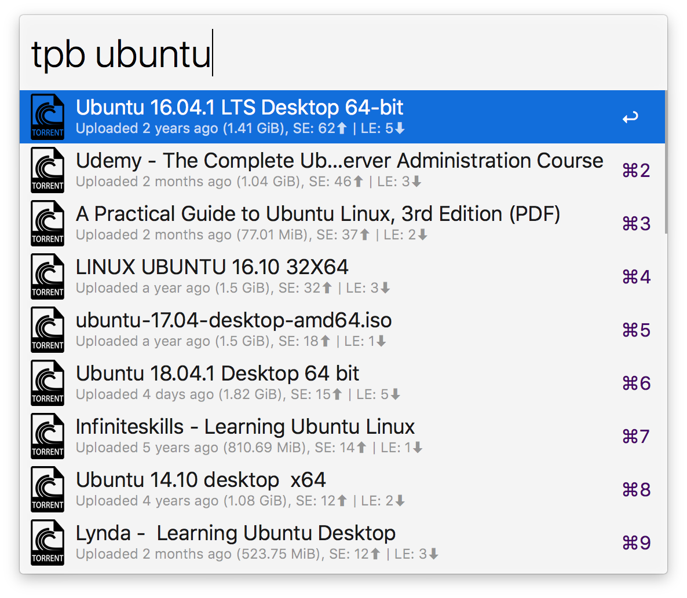

# alfred-tpb

> [Alfred 3](https://www.alfredapp.com) workflow to browse and download torrents from The Pirate Bay.

## Install

``
$ npm install --global alfred-tpb
``

*Requires [Node.js](https://nodejs.org) 4+ and the Alfred [Powerpack](https://www.alfredapp.com/powerpack/).*

## Usage

In Alfred, type `tpb`, <kbd>Enter</kbd>, and your desired search query.

To download a torrent with your default client, simply select it in the interface.  
You can also visit the torrents URL by pressing <kbd>⌘</kbd> whilst selecting it.
